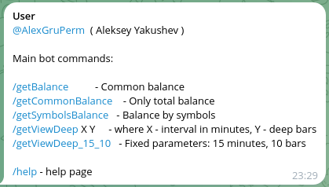
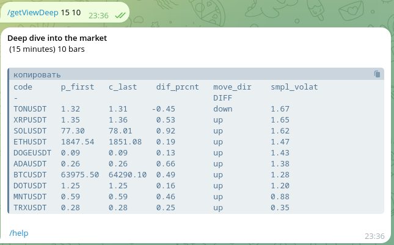
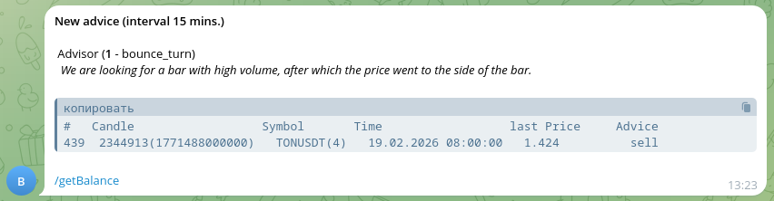
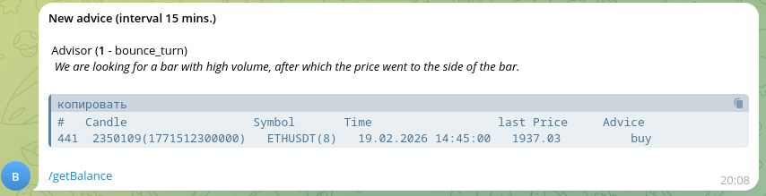
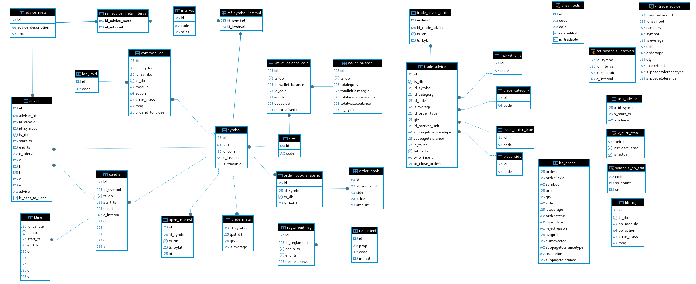
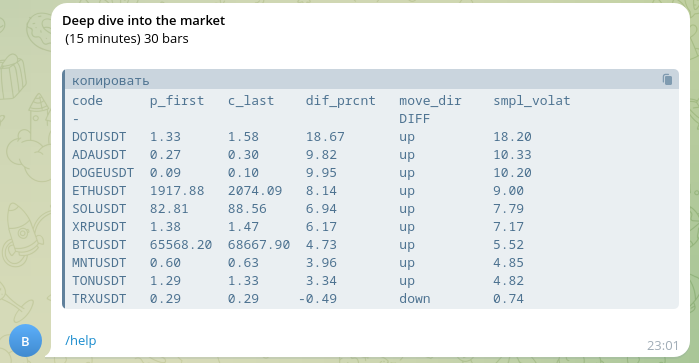
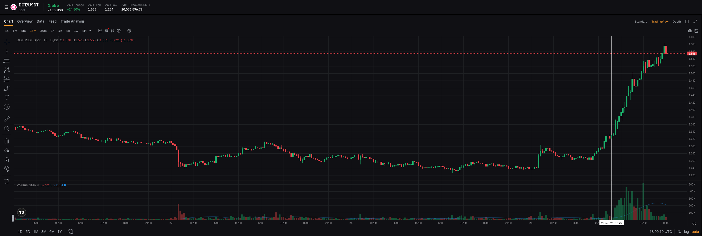
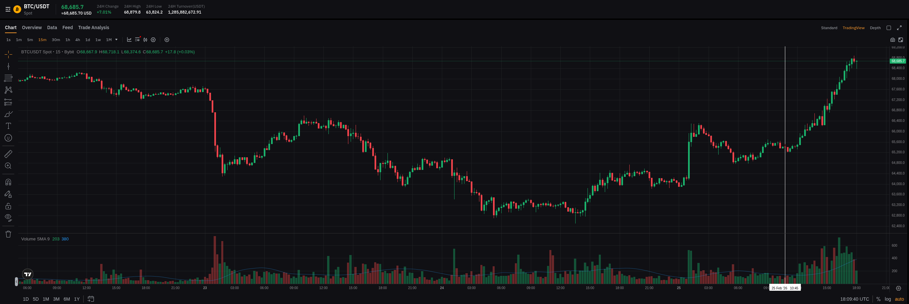
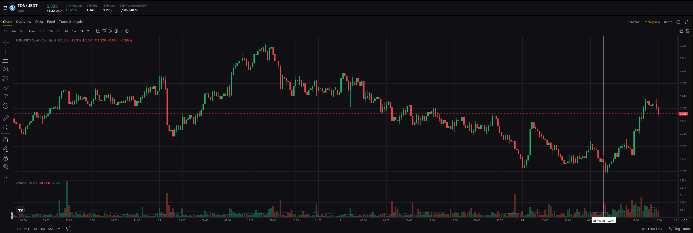
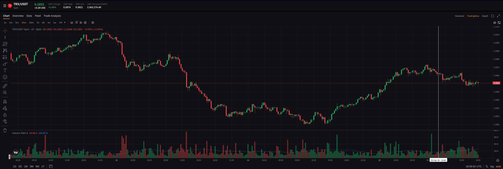

# bb_bot - bot for help trading on ByBit.

This project is for educational purposes. However, it can also be used in real trading.  
It collects data from the ByBit exchange, stores it in a database, analyzes it, and provides trading advice via a Telegram bot.

## 1. [Common description](#1-common-description-1)
## 2. [Technical description](#2-technical-description-1)
## 3. [Language and libraries](#3-language-and-libraries-1)
## 4. [Installation](#4-installation-1)
## 5. [Configuration](#5-configuration-1)
## 6. [Telegram bot description](#6-telegram-bot-description-1)
## 7. [Examples of advices](#7-examples-of-advices-1)
## 8. [Recommendations](#8-recommendations-1)
## 9. [Explanation of volatility](#9-explanation-of-volatility-1)

  
### 1. Common Description

This bat is a helper for trading on ByBit. It gathers data from ByBit API (near real time), save it into your Postgres database. 
Sometimes (in periodical basis) it runs check of advisor and if new advice exists bot send advice to user (to you) in telegram chat.
You have chat with telegram bot, and it is personal chat without anybody else.
When you receive new advice you can make decision to buy or sell some crypto or make deep analysis.
You can see [examples of advices](#7-examples-of-advices-1).

### 2. Technical description
Technically bot is a couple of applications (fat jars):
1) gather.jar - save candle (and kline) of selected coins (XXX/USDT), user balance, order books into Postgres database.  
   Using ByBit V5 API (with GET requests and webSocket).  
2) trade_bot.jar - telegram bot for chat with bb_bot (ask questions, receiving advices)  
To run bot you can use Docker (in dock folder you can find: docker-compose, .enc, and special scripts to create and   
populate database - dock/pg/initdb/3_create_tables.sh).  
Both application and db runs in separate containers (as described in docker-compose.yml). 

### 3. Language and libraries.
 Scala as main programming language.  
 ZIO - library for asynchronous operations and functional effects.  
 zio(-json,-http,-streams,-config) as additional libraries.  
 Quill - for work with database.  
 HikariCP - as connection pool for database.  
 com.bot4s (telegram-core, telegram-akka) - for Telegram bot api.  

### 4. Installation
 1) First of all you need to install Docker and Docker Compose.    
 2) Create ByBit V5 api key https://www.bybit.com/en/help-center/article/How-to-create-your-API-key, and it's recommended to  
    create api key for subaccount (with low balance).
 3) Create telegram certificate https://core.telegram.org/bots/self-signed  
    (you need to use ip address of your server for "What is your first and last name?" - keytool -genkey )
 4) Create new telegram bot with BotFather 
 5) Build both bot applications and put in the docker directories. 
    (For example: sbt ";project gather; clean; compile; assembly")
 6) Run docker-compose up -d  

### 5. Configuration
  Both application runs with same config file  (f.e.:control.conf look at scripts /start.sh)
  ```json 
  {
   "bybitAccount": {
      "key": "xxxxxxxxxxxxxxxxxx",
      "secret": "yyyyyyyyyyyyyyyyyyyyyyyyyyyyyyyyyyyy",
      "limit_order_book": 200,
      "interval_oi" : "5min",
      "limit_open_interest": 1,
      "recvWindow": "5000",
      "pp_check_freq_sec": 1,
      "pp_check_restart": 8,
      "check_restart_savebar_freq": 5,
      "save_order_book_freq_mins": 1
   },
   "db": {
      "driver": "org.postgresql.Driver",
      "url": "jdbc:postgresql://postgres_db:5432/bybit",
      "username": "bb_user",
      "password": "bb_pwd",
      "maximumPoolSize" : 8,
      "minimumIdle": 2,
      "connectionTimeout": 5000,
      "poolName": "pg-pool-trade-bot",
      "autoCommit" : true
   },
   "telegram": {
      "token" : "xxxxxxxxxx:yyyyyyyyyyyyyyyyyyyyyyyyyyyyyyyyyyy",
      "webhook_port" : 8443,
      "webhookUrl" : "https://1.2.3.4:8443",
      "keyStorePassword" : "111222333",
      "pubcertpath" : "/your_path/bb_bot.pem",
      "p12certpath" : "/your_path/bb_bot.p12",
      "users" : ["123123123"]
   }
}
  ```
Where 1.2.3.4 is ip address of your server when docker is running (don't forget open port 8443 and make port forwarding)
You can use postgres_db (as db service name) when running all in Docker.

### 6. Telegram bot description
Main page or help page:  
  
There are some commands to see balance and ViewDeep.

For examples:  
  
Aggregated information about your coins (select * from data.symbol)
made for candles (bars) of M15 with using last 10 candles. Here you can see  
price changing in simple percents, price direction (up or down) and simple volatility.
This aggregated information can be useful for trading.

### 7. Examples of advices  

Examples of advices in telegram chat:  
  


## 8. Recommendations
1) In DBeaver or any IDE for Postgres set initialization query: SET TIME ZONE 'UTC';  
  
2) Each advisor is a plpgsql function with same interface data.function_name(p_id_symbol integer, p_start_ts bigint)  
   (look at function data.bounce_turn it work only for M15 and some parameters fixed inside) you can add as many advisors as you want. 
   Just register it in table data.advice_meta and make relation with intervals in data.ref_advice_meta_interval   
  
3) Simple ER - diagram for database:  
      
     
4) Candles saved in table "data.candle"  
   Current building candles (with webSocket data)  
   ```sql 
    select * from data.candle c where c.end_ts is null
   ```  
   Internal content on each candle. You can see how internal data growing in real time for one last candle:  
    ```sql 
    select *
      from data.kline k
     where k.id_candle = (select c.id
                            from data.candle c
                           where c.end_ts is null
                             and c.id_symbol  = 4   /* TONUSDT */
                             and c.c_interval = '1' /* 1 minute */)
    ```  
     
5) Wallet balance (common and divided by crypto coins)  
   ```sql 
    /* updated each 5 seconds.  */
    select *
      from data.wallet_balance wb
     order by wb.id desc
    
    select *
      from data.wallet_balance_coin wbc
     where wbc.id_wallet_balance = (select max(wb.id)
                                      from data.wallet_balance wb)
     order by wbc.equity desc
   ```   
  
6) Common log. Some errors logged in table. It can be error related with empty data from ByBit, or error with PingPong that  
      used for keeping webSocket chanel. Socked reopened automatically (when internet or net was broken for some time).  
  
```sql     
    select * 
      from data.common_log cl
     order by cl.id desc 
   ```

## 9. Explanation of volatility
When you execute bot (telegram) command /getViewDeep 15 30 (For example. It means that you want to get ViewDeep information  
for M15 and 30 candles)
 You can see response like this (it's real and made in 25 February 2026)  



Last column "Simple volatility" shows how much the price changes.  
Maximum is 18.20 for DOT/USDT  
Middle values for BTC/USDT and TON/USDT  
Lowest value is 0.74 for TRX/USDT

There are graphics for these coins, you can compare price changing visually. 

  

  

  



If you have questions you can sak me: [bb_bot@bk.ru](bb_bot@bk.ru) or in [telegram](https://t.me/AlexGruPerm)   